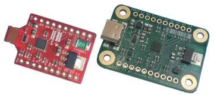

# USB Type-C / PIC32 Breakout and Development Board
This is the GitHub repository containing the code, schematics and documentation for the USB Type-C / PIC32 Breakout and Development Board.

See [Hello, World !](https://github.com/lophtware/UsbCPic32Breakout/wiki/HelloWorld) for the obligatory blinking LED, and the
[wiki](https://github.com/lophtware/UsbCPic32Breakout/wiki/) for project documentation.  The wiki is also mirrored by
[GitHub Pages](https://lophtware.github.io/) and the company's site is [www.lophtware.co.uk](https://www.lophtware.co.uk/).

Browse the [firmware](src/firmware/) directory for the firmware, the [examples](src/examples/) directory for the examples, or check out the schematics
([Full Fat](https://github.com/lophtware/UsbCPic32Breakout/wiki/Schematics.pdf)
and [Lite](https://github.com/lophtware/UsbCPic32Breakout/wiki/Schematics-Lite.pdf))
if you're wanting to roll your own firmware or are just plain curious as to
how it works.

## Implemented Features
The following list is the current state of the firmware features, both implemented and planned:

  - [x] [Non-Volatile Configuration](https://github.com/lophtware/UsbCPic32Breakout/wiki/UsbDeviceModel-Core-Interface)
  - [x] [GPIO / Bit-Banging](https://github.com/lophtware/UsbCPic32Breakout/wiki/UsbDeviceModel-Core-Interface)
  - [x] [Pin Change Notifications](https://github.com/lophtware/UsbCPic32Breakout/wiki/UsbDeviceModel-Core-Interface)
  - [x] [USB Status Flags (Current Limit, Cable Orientation, Charger Detection, etc.)](https://github.com/lophtware/UsbCPic32Breakout/wiki/UsbDeviceModel-Usb-Interface)
  - [x] I2C [Master](https://github.com/lophtware/UsbCPic32Breakout/wiki/UsbDeviceModel-I2c-Interface) and [Slave](https://github.com/lophtware/UsbCPic32Breakout/wiki/I2c-Index)
  - [x] [SPI / I2S Master](https://github.com/lophtware/UsbCPic32Breakout/wiki/UsbDeviceModel-Spi-Interface)
  - [ ] UART Master
  - [ ] PWM
  - [ ] CCP
  - [ ] Timers
  - [ ] ADC
  - [ ] Comparator
  - [ ] Configurable Logic Cells
  - [ ] Suspend

## Not Got One ?
If you've landed here and you've not got one of these and you'd like one then...

## Licences
Consult the individual *LICENSE* files for the specific terms that pertain to the contents of a directory tree, but in general the software and firmware
are licensed under the highly permissive terms of the MIT licence, whilst the documentation and hardware fall under the
[CC-BY-SA 4.0 licence](https://creativecommons.org/licenses/by-sa/4.0/).

The following third-party components also have their own licences:
- [m-stack](https://github.com/signal11/m-stack/) is licensed under [LGPL v3](src/firmware/src/Usb/m-stack/LICENSE-LGPL3.txt)

Any datasheets, specifications, etc. in the repository obviously belong to their respective authors along with copyright and any other rights.  They are all
in the public domain and stored along with this project purely for ease of reference during development.  See the individual documents for details.
